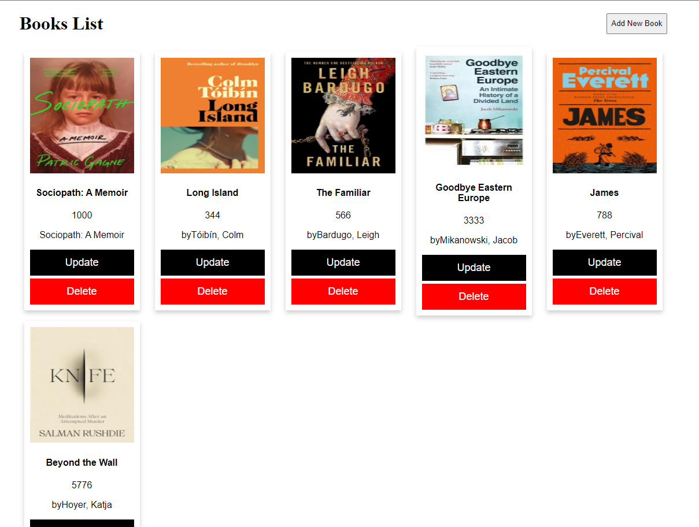

## Getting Started

Make a book Shop CRUD Application using mysql,nodejs,& react. If any one want run the application I add database also in file.


 

#### First, run the Backend  server using below cmd:
```bash
npm i
npm start
```

#### Then, run the FrontEnd using below cmd:
```bash
npm run dev
# or
yarn dev
# or
pnpm dev
# or
bun dev
```

